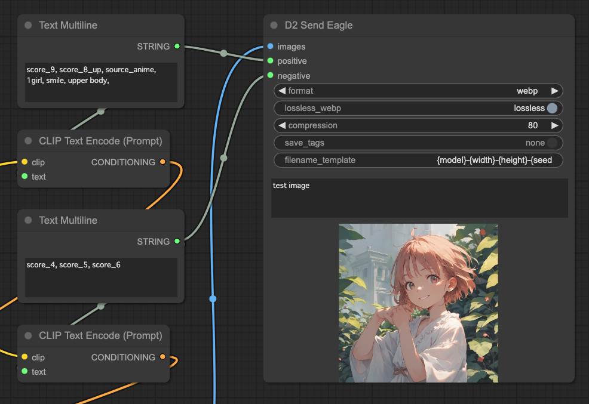
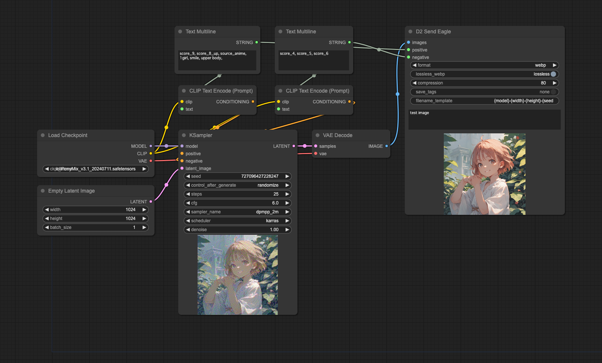

# D2 Send Eagle

[<a href="README.md">English</a>][<a href="README_ja.md">日本語</a>][繁体中文]

這是一個用於 ComfyUI 的自定義節點，可將生成的圖像發送到圖像管理軟體 [Eagle](https://en.eagle.cool/)。

這是對現有自定義節點 [ComfyUI-send-eagle-slim](https://github.com/shingo1228/ComfyUI-send-eagle-slim) 的擴展，根據個人喜好進行了修改。感謝 Shingo.T 製作了原始的優秀自定義節點。

## 示例工作流程

---

## 主要功能

- 將通過 `image` 接收的圖像發送到 Eagle
- 將通過 `positive` 和 `negative` 接收的文本作為備忘錄記錄在 Eagle 中
- 可選擇 png 格式或 webp 格式

### png 格式和 webp 格式的區別

- png 格式
  - **可以保存** ComfyUI 工作流程
  - **無法顯示**在 StableDiffusion webui A1111 的 PNGInfo 中
- webp 格式
  - **無法保存** ComfyUI 工作流程
  - **可以顯示**在 StableDiffusion webui A1111 的 PNGInfo 中

---

## 安裝

### 使用 ComfyUI Manager

1. 打開 ComfyUI Manager
2. 點擊 `Custom Nodes Manager`
3. 搜索 `D2 Send Eagle`
4. 點擊 `Install`
5. 重啟 ComfyUI

### 使用命令提示符

1. 打開命令提示符
2. 導航到 `{ComfyUI安裝文件夾}/custom_nodes`
3. 執行 `git clone https://github.com/da2el-ai/ComfyUI-d2-send-eagle`

---

## 輸入 / 選項

- `images`
  - 要保存的圖像
- `positive`
  - 正面提示詞
- `negative`
  - 負面提示詞
- `format`
  - 從 webp / png 中選擇保存格式
- `lossless_webp`
  - 選擇無損（lossless）或有損（lossy）。選擇 `webp` 時有效。
- `compression`
  - 指定壓縮率。在 webp 中選擇 `lossy` 時有效。
- `save_tags`
  - 選擇是否作為 Eagle 標籤保存
  - `None`: 不保存
  - `Prompt + Checkpoint`: 保存提示詞和模型名稱
  - `Prompt`: 保存提示詞
  - `Checkpoint`: 保存模型名稱
- `filename_template`
  - 指定文件名格式
  - 默認為 `{model}-{width}-{height}-{seed}`
  - 可用參數: `width`、`height`、`model_name`、`steps`、`seed`
- `eagle_folder`
  - 指定 Eagle 文件夾名稱或文件夾 ID。如果文件夾不存在，將創建新文件夾。

---

## 其他功能

### 本地保存圖像

除了發送到 Eagle，圖像還會保存在本地環境的以下文件夾中。
這個文件夾名稱不能更改。

`./ComfyUI/output/YYYY-MM-DD/YYYYMMDD_HHMMss_SSSSSS-{FinalImage_width}-{FinalImage_height}.webp`

### 支持的 KSampler

支持以下 KSampler 類型。
您可以通過編輯 `config.yaml` 來添加更多。

- KSampler
- KSamplerAdvanced
- KSampler With Refiner (Fooocus)
- BNK_TiledKSampler
- KSampler (Efficient)
- GenerateNAID

---

## 更新日誌

- 2024/09/29
  - 添加對 NovelAI 生成節點 GenerateNAID 的支持
  - 使得可以在 `config.yaml` 中指定設置項目
  - 在 webp 格式時將提示詞信息記錄在 Exif 中
- 2024/08/19
  - 修復使用 Unet Loader 時無法獲取模型名稱的問題
- 2024/08/04
  - 初步發布
