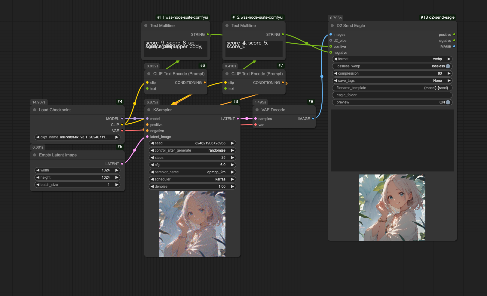
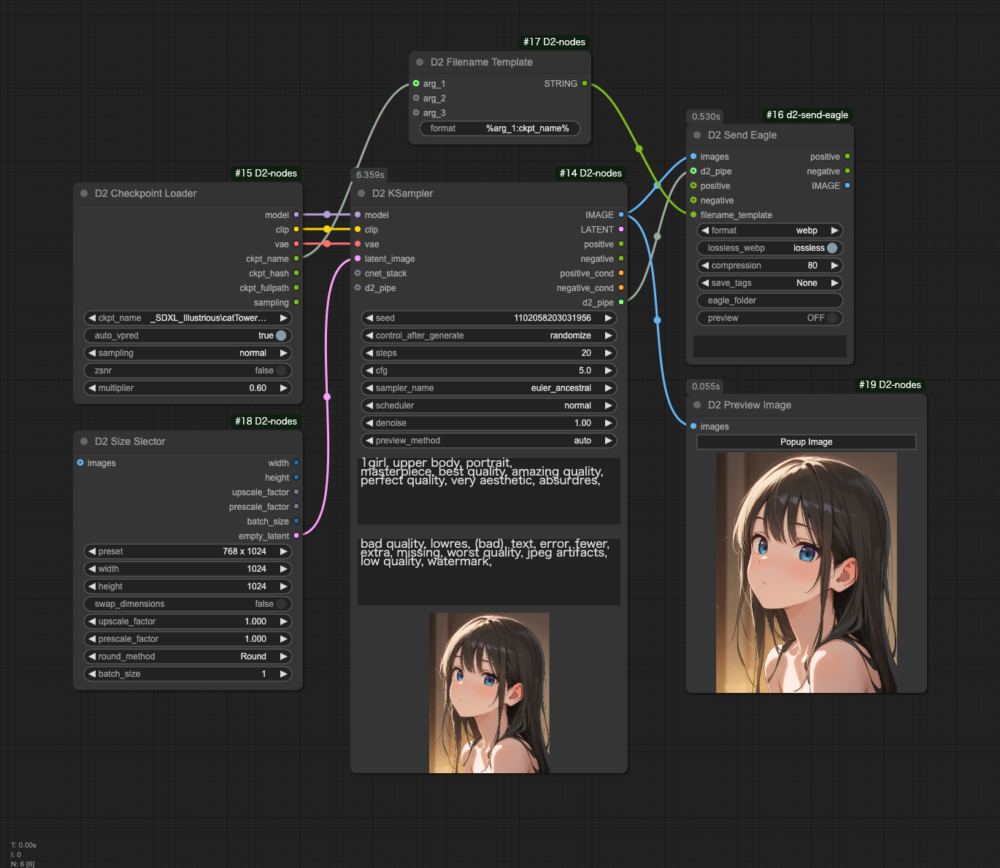

# D2 Send Eagle

[<a href="README.md">English</a>][<a href="README_ja.md">日本語</a>][繁体中文]

這是一個自定義節點，用於將 ComfyUI 生成的圖片發送到圖片管理軟件 [Eagle](https://en.eagle.cool/)。

也請嘗試使用 [D2 Nodes ComfyUI](https://github.com/da2el-ai/d2-nodes-ComfyUI/)，其中包含了許多實用的自定義節點。

## 範例工作流程

### 基礎配置工作流程

### 使用 D2 Nodes ComfyUI 的工作流程

- 從 `D2 Checkpoint Loader` 獲取檢查點名稱，並使用 `D2 Filename Template` 刪除 ".safetensors" 副檔名
- 從 `d2_pipe` 獲取生成參數

---

## 主要功能

- 將通過 `image` 接收的圖片發送到 Eagle
- 將通過 `positive` 和 `negative` 接收的文字記錄為 Eagle 備註
- 支持 png 和 webp 格式

### 作為圖片和 Eagle 註釋記錄的生成參數

- 參數如 positive、negative、CFG、steps 等是從連接到 D2 Send Eagle 的 KSampler 獲取的
- 根據工作流程的不同，可能無法獲取
- 也可以通過 d2_pipe 指定參數

#### 支持的 KSampler

支持以下 KSampler 類型。
可以通過編輯 `config.yaml` 來添加更多。

- KSampler
- KSamplerAdvanced
- KSampler With Refiner (Fooocus)
- BNK_TiledKSampler
- KSampler (Efficient)
- GenerateNAID

### png 和 webp 格式的區別

- png 格式
  - **可以**保存 ComfyUI 工作流程
  - **無法**顯示在 StableDiffusion webui A1111 的 PNGInfo 中
- webp 格式
  - **無法**保存 ComfyUI 工作流程
  - **可以**顯示在 StableDiffusion webui A1111 的 PNGInfo 中

---

## 安裝

### 使用 ComfyUI Manager

1. 打開 ComfyUI Manager
2. 點擊 `Custom Nodes Manager`
3. 搜索 `D2 Send Eagle`
4. 點擊 `Install`
5. 重啟 ComfyUI

### 使用命令提示符

1. 打開命令提示符
1. 進入 `{ComfyUI 安裝資料夾}/custom_nodes`
2. `git clone https://github.com/da2el-ai/ComfyUI-d2-send-eagle`

---

## 輸入 / 選項

- `images`
  - 要保存的圖片
- `d2_pipe`
  - 生成參數的集合
- `positive`
  - 正向提示詞
- `negative`
  - 負向提示詞
- `format`
  - 從 webp / png / jpeg 中選擇保存格式
- `lossless_webp`
  - 選擇無損（lossless）或有損（lossy）。選擇 `webp` 時有效。
- `compression`
  - 指定壓縮率。選擇 webp 的 `lossy` 或使用 `jpeg` 時有效。
- `save_tags`
  - 選擇是否保存為 Eagle 標籤
  - `None`: 不保存
  - `Prompt + Checkpoint`: 保存提示詞和模型名稱
  - `Prompt`: 保存提示詞
  - `Checkpoint`: 保存模型名稱
- `filename_template`
  - 指定檔案名格式
  - 預設為 `{model}-{width}-{height}-{seed}`
  - 可用參數：`width`、`height`、`model_name`、`steps`、`seed`
- `eagle_folder`
  - 指定 Eagle 資料夾名稱或資料夾 ID。如果不存在則創建新資料夾

---

## 其他功能

### 本地圖片保存

除了發送到 Eagle，圖片也會保存在本地的以下資料夾中。
此資料夾名稱無法更改。

`./ComfyUI/output/YYYY-MM-DD/YYYYMMDD_HHMMss_SSSSSS-{FinalImage_width}-{FinalImage_height}.webp`

---

## 更新日誌

- 2024/12/28
  - 添加對 d2-node-comfyui 的 d2_pipe 支持
- 2024/11/13
  - 添加 JPEG 格式支持
- 2024/10/04
  - 添加隱藏圖片預覽的切換按鈕
    - 因為放大預覽時 `memo_text` 也會一起放大很不方便
  - 添加 IMAGE 到輸出
    - 僅作為傳遞。不是必要的但還是添加了
- 2024/09/29
  - 添加對 NovelAI 生成節點 GenerateNAID 的支持
  - 使設置可通過 `config.yaml` 配置
  - 為 webp 格式添加 Exif 提示詞信息記錄
- 2024/08/19
  - 修復使用 Unet Loader 時無法獲取模型名稱的問題
- 2024/08/04
  - 初始發布

---

## 致謝

D2 Send Eagle 是對現有自定義節點 [ComfyUI-send-eagle-slim](https://github.com/shingo1228/ComfyUI-send-eagle-slim) 的擴展，根據個人喜好進行了修改。感謝 Shingo.T 製作了如此優秀的自定義節點。
